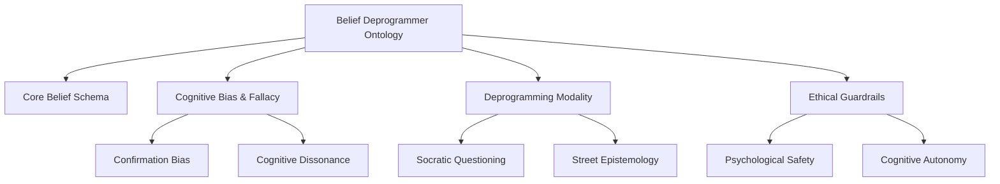

# Ontology & Taxonomy Manifesto

This document serves as the foundational structural blueprint for the Belief Deprogrammer project, defining the core ontological entities, relationship schemas, and taxonomies that govern knowledge classification.

> [!IMPORTANT]
> All new content ingested into the Belief Deprogrammer knowledge graph must strictly adhere to the schemas and definitions outlined here to preserve conceptual integrity.

---

## 1. Core Ontological Entities

Our knowledge graph is built around four fundamental node types:

### A. Core Belief (`node:Core Belief`)
An entrenched cognitive anchor or ideological premise that forms the basis of a subject's worldview.
*   **Attributes**: Atomic statement, emotional intensity, validation source.
*   **Relationship**: Target of a `Deprogramming Vector`.

### B. Cognitive Bias (`node:Cognitive Bias`)
A systematic pattern of deviation from norm or rationality in judgment, which reinforces and protects core beliefs from disconfirming evidence.
*   **Attributes**: Operational mechanism, trigger condition, countermeasure.
*   **Relationship**: Mitigated by methodologies in the [Cognitive Bias Index](./cognitive_bias_and_fallacy_index.md) (and detailed for specific biases like [Confirmation Bias](./cognitive_biases/confirmation_bias.md)).

### C. Echo Chamber (`node:Echo Chamber`)
A social or digital environment that reinforces cognitive biases and insulates beliefs from external challenge.
*   **Attributes**: Media density, sociological isolation index, feedback loop type.
*   **Relationship**: Analyzed and mitigated using [Deprogramming Playbook](./deprogramming_methodologies_playbook.md) tactics.

### D. Deprogramming Vector (`node:Deprogramming Vector`)
A targeted cognitive intervention path designed to bypass cognitive biases and restore epistemological autonomy.
*   **Attributes**: Active ingredient, risk level, step-by-step protocol.
*   **Relationship**: Executed via protocols defined in the [Methodologies Playbook](./deprogramming_methodologies_playbook.md) (and applied in vectors like [Socratic Questioning](./methodologies/socratic_questioning.md)).

---

## 2. Dynamic Taxonomy Schema

We classify all concepts across four orthogonal dimensions:

---

## 3. Directional Semantic Links

Every edge in our semantic graph must be explicitly defined. The primary relationships allowed are:

*   `mitigates` / `is_mitigated_by`
*   `triggers` / `is_triggered_by`
*   `reinforces` / `is_reinforced_by`
*   `proves` / `is_proven_by`
*   `secures` / `is_secured_by`

---

## 4. Contextual Semantic Connectivity

To ensure that the graph is navigable and contains no dead ends, this manifesto is connected to the rest of the OKF corpus:

*   **Main Directory Link**: This manifesto is anchored directly to the [Belief Deprogrammer Index](./index.md) (which serves as the root hub of the entire OKF project).
*   **Taxonomy Application**: Detailed definitions of cognitive mechanisms governed by this taxonomy are in the [Cognitive Bias Index](./cognitive_bias_and_fallacy_index.md) (where individual bias and fallacy entries are categorized).
*   **Methodological Enactment**: The translation of ontological vectors into practice is detailed in the [Deprogramming Playbook](./deprogramming_methodologies_playbook.md) (which defines active intervention tactics).
*   **Empirical Grounding**: Verification of this taxonomy against clinical and historical trials is recorded in the [Empirical Evidence Ledger](./case_study_and_empirical_evidence_ledger.md) (which acts as the empirical verification node).
*   **Safety Integration**: The ethical boundaries of all ontological classes are enforced via the [Ethical Guardrails](./ethical_guardrails_and_harm_reduction_framework.md) (which ensures that all deprogramming vectors maintain strict safety compliance).
